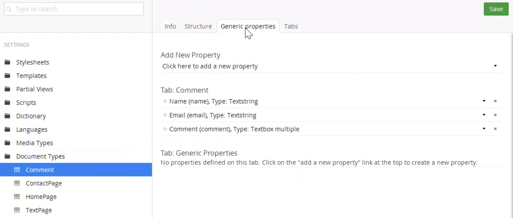

# Content API

## Intro
The Content API can be used to programmatically create and edit content.

We will primarily make use of SurfaceControllers' Services property.

## Creating Content
ContentService - our gateway to Content API. Available on the `Services` property of our SurfaceController. 

`ContentService.CreateContent(Name, ParentId, DocumentTypeAlias)` can be used to create a content item.

We will be using the following document type:


In backoffice, find ID of parent content. In this example we are using a basic subpage and creating comments for the page. The content structure is  
Subpage (id: 1051)  
&nbsp;&nbsp;&rarr; Comment (alias: "Comment")

In our surface controller, we use the following methods to create and publish a new content item:
```csharp
public class CommentFormController : SurfaceController
{
    [HttpPost]
    public ActionResult Submit(CommentFormViewModel model)
    {
        // Get ID of current page
        var parentId = CurrentPage.Id; // 1051

        // Create an intance of IContent
        var newComment = Services.ContentService.CreateContent("comment", parentId, "Comment");

        // Set values of new content item
        newComment.SetValue("name", model.Name);
        newComment.SetValue("email", model.Email);
        newComment.SetValue("comment", model.Comment);

        // Persist changes
        Services.ContentService.SaveAndPublish(newComment);

        TempData["success"] = true;

        return RedirectToCurrentUmbracoPage();
    }
}

```
