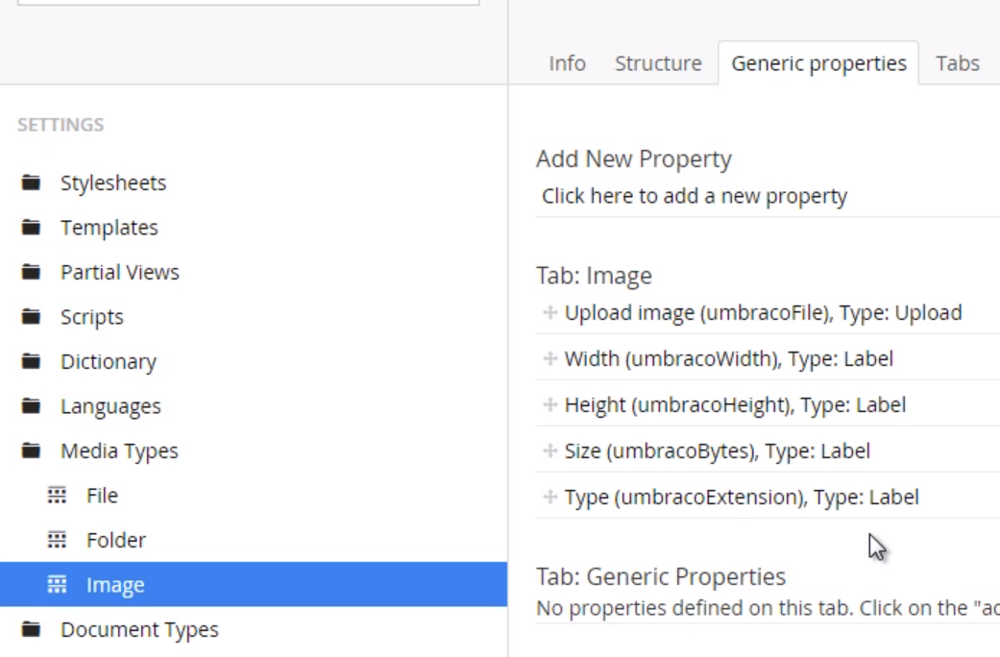

# Media API
`MediaService` is our gateway to the Media API.  
`MediaService` is available from the `Services` property of our `SurfaceController`.

## These notes
Show how to create an image or collection of images programmatically using a `SurfaceController`


## Setting up the model
We will use a plain object model.

```csharp
public class ImageGalleryFormViewModel
{
    [Required]
    public int GalleryId { get; set; }

    [Required]
    public IEnumerable<HttpPostedFileBase> Files { get; set; }
}
```

## Setting up the view
We will use a basic MVC partial for our image gallery upload form.
```csharp
@if(TempData["success"] == null)
{
    using(Html.BeginUmbracoForm<UmbracoProject.Controllers.ImageGalleryController>("HandleFormSubmit"))
    {
        @Html.HiddenFor(m => m.GalleryId)
        <input type="file" name="Files" multiple /><br>
        <button id="contact-submit" type="submit">Submit</button>
    }
} else {
    <p>Media created successfully!</p>
}

```

## Setting up the controller
We will need a method to render the form, and another method to handle the form submission.

```csharp
public class ImageGalleryController: SurfaceController
{
    public ActionResult Index(int galleryId)
    {
        var model = new ImageGalleryFormViewModel { GalleryId = galleryId };

        return PartialView("ImageGalleryForm", model);
    }

    [HttpPost]
    public ActionResult HandleFormSubmit(ImageGalleryFormViewModel model)
    {
        if(!ModelState.IsValid) return CurrentUmbracoPage();

        // create new media images here

        TempData["success"] = true;
        return RedirectToCurrentUmbracoPage();
    }
}
```

## Creating the media
In order to create media programmatically, we need to have the following information:
 - Name
 - ParentId
 - MediaTypeAlias

In order to populate the media item with content, we will need to set the values of a new media object. For this example, we are using the `Image` media type, so we have the following properties available to use:


We will need to modify the `HandleFormSubmit` method of our `ImageGalleryController` like so:
```csharp
[HttpPost]
public ActionResult HandleFormSubmit(ImageGalleryFormViewModel model)
{
    if(!ModelState.IsValid) return CurrentUmbracoPage();

    // create new media images here
    foreach (var file in model.Files)
    {
        // Create the new media objects
        var media = Services.MediaService.CreateMedia(file.FileName, model.GalleryId, "Image");

        // Populate property values.
        // Pass in the actual HttpPostedFileBase object
        // Note: Umbraco will populate the other properties (Width, Height, Size, Type) for this media object
        media.SetValue("umbracoFile", file); 


        // Persist changes
        Services.MediaService.Save(media);
    }

    TempData["success"] = true;
    return RedirectToCurrentUmbracoPage();
}
```
